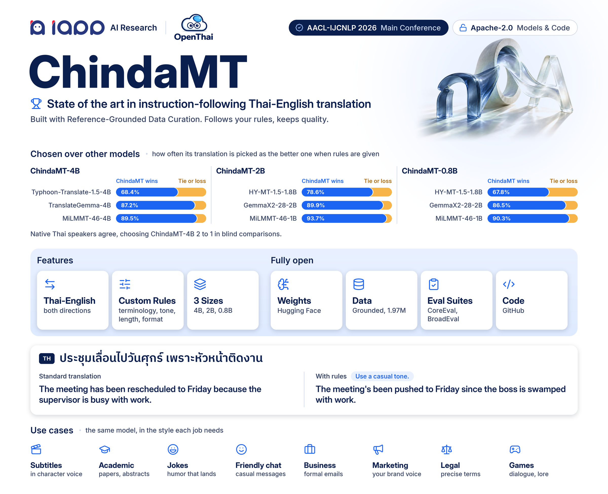

<p align="center">
  
</p>

# ChindaMT-RGDC

[](https://www.python.org/)
[](https://github.com/huggingface/transformers)
[](https://huggingface.co/models?search=iapp/ChindaMT)
[](https://huggingface.co/datasets?search=iapp/ChindaMT)
[](LICENSE)
[](https://arxiv.org/abs/2609.34770)
[](https://arxiv.org/abs/2609.34770)

Code for **Reference-Grounded Data Curation for Instruction-Following Thai-English Machine
Translation** (AACL-IJCNLP 2026 Main Conference).

**Paper:** [arXiv:2609.34770](https://arxiv.org/abs/2609.34770) | **Models:** [4B](https://huggingface.co/iapp/ChindaMT-4B), [2B](https://huggingface.co/iapp/ChindaMT-2B), [0.8B](https://huggingface.co/iapp/ChindaMT-0.8B) | **Data:** [Grounded](https://huggingface.co/datasets/iapp/ChindaMT-Grounded) | **Suites:** [CoreEval](https://huggingface.co/datasets/iapp/ChindaMT-CoreEval), [BroadEval](https://huggingface.co/datasets/iapp/ChindaMT-BroadEval)

## Contents

- [Overview](#overview)
- [Repository layout](#repository-layout)
- [Installation](#installation)
- [Quick start](#quick-start)
- [Documentation](#documentation)
- [Citation](#citation)
- [License](#license)

## Overview

RGDC extracts every constraint from a reference translation that already satisfies it, so each
constraint is feasible by construction.

| Phase | What it does | Result |
|---|---|---|
| 1. Data selection | Scores a 17.85M-record English-Thai pool by Instruction-Following Difficulty (IFD) and keeps the top decile | 1.75M records |
| 2. Constraint augmentation | Extracts constraints from each reference, regenerates under them, keeps candidates that pass every constraint | [Grounded](https://huggingface.co/datasets/iapp/ChindaMT-Grounded), 1.97M records |

ChindaMT is fine-tuned from Qwen3.5 on Grounded at 4B, 2B, and 0.8B parameters. It translates in
both directions and follows rules on terminology, register, length, and output format.

## Repository layout

| Path | Contents |
|---|---|
| [config/](config/) | Pipeline, training, and evaluation configurations |
| [docs/](docs/) | Guides |
| [env/](env/) | Conda environments |
| [patches/](patches/) | Local fixes for the two submodules |
| [scripts/](scripts/) | Drivers for Phase 1, Phase 2, and evaluation |
| [src/](src/) | `data` pool, `cherry` Phase 1, `augment` Phase 2, `eval` inference and metrics |
| [tests/](tests/) | IFD span-alignment tests |
| [alpaca_eval](https://github.com/tatsu-lab/alpaca_eval), [training/LlamaFactory](https://github.com/hiyouga/LlamaFactory) | Submodules for judging and fine-tuning |

## Installation

```bash
git clone https://github.com/iapp-technology/ChindaMT-RGDC.git && cd ChindaMT-RGDC
git submodule update --init --recursive
git -C alpaca_eval apply ../patches/alpaca_eval.patch
git -C training/LlamaFactory apply ../../patches/llamafactory.patch
conda env create -f env/environment-chindamt.yml         # pipeline and evaluation
conda env create -f env/environment-chindamt-comet.yml   # CometKiwi only
cp .env.example .env                                     # judge endpoint, key, model
```

Details: [environments](env/README.md), [patches](patches/README.md), [training setup](docs/training.md#setup).

## Quick start

```python
from transformers import AutoTokenizer, AutoModelForCausalLM
import torch

model_id = "iapp/ChindaMT-4B"
tokenizer = AutoTokenizer.from_pretrained(model_id)
model = AutoModelForCausalLM.from_pretrained(model_id, torch_dtype=torch.bfloat16, device_map="auto")

prompt = "Translate English to Thai.\nRules:\n- Return only the translated text\n\nEN: The weather is nice today."
text = tokenizer.apply_chat_template([{"role": "user", "content": prompt}],
                                     add_generation_prompt=True, tokenize=False, enable_thinking=False)
inputs = tokenizer(text, return_tensors="pt").to(model.device)
out = model.generate(**inputs, max_new_tokens=1024, temperature=0.01, top_p=0.7, top_k=20,
                     repetition_penalty=1.05, do_sample=True)
print(tokenizer.decode(out[0][inputs["input_ids"].shape[1]:], skip_special_tokens=True))
```

Requires `transformers` 5.2 or newer. Prompt formats and settings: [model card](https://huggingface.co/iapp/ChindaMT-4B).

## Documentation

| Guide | Covers |
|---|---|
| [Data pipeline](docs/data_pipeline.md) | Build Grounded: pool, Phase 1, Phase 2 |
| [Training](docs/training.md) | Fine-tune ChindaMT with LLaMA-Factory |
| [Evaluation](docs/evaluation.md) | Serving the judge, pairwise judging on CoreEval and BroadEval, cross-judges, external metrics |
| [Testing](docs/testing.md) | Unit tests and smoke checks |
| [Source corpora](docs/corpora.md) | The ten corpora and where to obtain them |

## Citation

```bibtex
@misc{chayintr2026rgdc,
  title         = {Reference-Grounded Data Curation for Instruction-Following Thai-English Machine Translation},
  author        = {Chay-intr, Thodsaporn and Harnchang, Krittapad and Thabua, Mahannop and Viriyayudhakorn, Kobkrit and Theeramunkong, Thanaruk},
  year          = {2026},
  eprint        = {2609.34770},
  archivePrefix = {arXiv},
  primaryClass  = {cs.CL},
  url           = {https://arxiv.org/abs/2609.34770},
  note          = {Accepted at AACL-IJCNLP 2026 (Main Conference)}
}
```

## License

Code and model weights: [Apache-2.0](LICENSE). Grounded and the suites: CC-BY-SA 4.0, with one
BroadEval row under CC-BY-NC-4.0.
